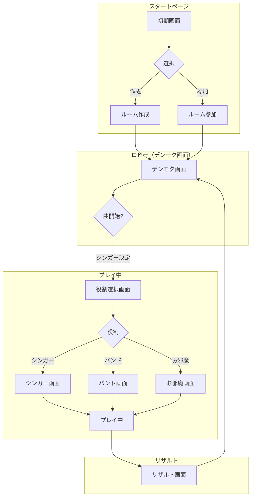

# 02. 画面遷移

## 2.1 画面フロー図

---

## 2.2 画面一覧

### 初期画面（スタートページ）
- **目的**: ルーム作成または参加の選択
- **要素**:
  - 「作成」ボタン
  - 「参加」ボタン
  - アプリロゴ・タイトル

---

### ルーム作成画面
- **目的**: 新しいルームを作成
- **要素**:
  - ルームコード自動生成（6桁）
  - ホストとして登録
  - 作成ボタン

---

### ルーム参加画面
- **目的**: 既存ルームに参加
- **要素**:
  - ルームコード入力フィールド
  - 名前入力フィールド（任意）
  - 参加ボタン

---

### デンモク画面（ロビー）
- **目的**: 曲を予約・管理し、ゲームを開始
- **要素**:
  - 曲リスト表示
  - 予約リスト
  - 予約追加/削除/順番変更
  - ルーレットボタン
  - 参加者一覧
  - 曲開始ボタン

**詳細**: [デンモク機能](./04_DENMOKU.md)

---

### 役割選択画面
- **目的**: シンガー以外のプレイヤーが役割を選択
- **要素**:
  - バンドボタン（ギター/ドラム/キーボード）
  - お邪魔ボタン
  - 参加者ステータス表示

**詳細**: [役割](./03_ROLES.md)

---

### シンガー画面
- **目的**: 歌詞を見ながら歌唱
- **要素**:
  - 歌詞表示（同期）
  - 応援コメント表示エリア
  - 背景（MV対応予定）

---

### バンド画面
- **目的**: リズムゲームでバンド演奏
- **要素**:
  - 楽器選択（初回のみ）
  - ノーツ表示
  - 判定ライン
  - スコア表示
  - コンボ表示

**詳細**: [リズムゲーム](./05_RHYTHM_GAME.md)

---

### お邪魔画面
- **目的**: 他プレイヤーを妨害
- **要素**:
  - お邪魔アクション一覧
  - クールダウン表示
  - 対象選択UI

**詳細**: [お邪魔機能](./06_OJAMA.md)

---

### リザルト画面
- **目的**: プレイ結果の表示
- **要素**:
  - 個人スコア一覧
  - 総合スコア
  - MVP表示
  - 「次の曲へ」ボタン（デンモクに戻る）

**詳細**: [スコア・ランキング](./07_SCORE_RANKING.md)

---

## 2.3 画面遷移ルール

### ルーム作成後
- 自動的にデンモク画面へ遷移
- ルームコードを他の参加者に共有

### 曲開始時
1. 予約リストの先頭曲を選択
2. 予約者が自動的にシンガーになる（ルーレット例外）
3. 他の参加者は役割選択画面へ

### 曲終了後
- リザルト画面を表示
- 一定時間後、またはボタン押下でデンモク画面に戻る

---

## 次へ

👉 [役割](./03_ROLES.md)で各役割の詳細を確認
