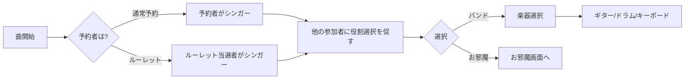

# 03. 役割

## 3.1 役割一覧

MinKaraには3つの役割があります：

| 役割 | アイコン | 人数 | 説明 |
|------|---------|------|------|
| **シンガー** | 🎤 | 1人 | 曲を予約した人が自動的になる。歌詞を見ながら歌う |
| **バンド** | 🎸🥁🎹 | 制限なし | リズムゲームで参加。楽器を選択 |
| **お邪魔** | 👻 | 制限なし | 他プレイヤーを妨害。専用役割 |

---

## 3.2 役割決定フロー

### ルール
1. **シンガー**は予約者が自動的に決定（選択不可）
2. **ルーレット**の場合のみ例外的にランダム選出
3. シンガー以外の参加者は**バンド**または**お邪魔**を選択
4. 役割は曲ごとに変更可能

---

## 3.3 シンガー

### 概要
- 曲を予約した人が自動的にシンガーになる
- 歌詞を見ながら歌唱
- 応援コメントを受信

### 画面要素
| 要素 | 説明 |
|------|------|
| **歌詞表示** | タイムラインと同期してハイライト |
| **応援コメントエリア** | バンド・お邪魔からのメッセージ表示 |
| **背景** | 曲のイメージまたはMV（将来対応） |

### スコアリング
- シンガーは**曲完走ボーナス**のみ（基本仕様）
- 歌唱評価は将来の拡張機能として検討

---

## 3.4 バンド

### 概要
- **リズムゲーム**でバンド演奏に参加
- 3つの楽器から選択：ギター、ドラム、キーボード

### 楽器一覧

#### 🎸 ギター
| 項目 | 内容 |
|------|------|
| **レイアウト** | 横スクロール（右から左へ） |
| **レーン数** | 6レーン（弦をイメージ） |
| **キー** | S, D, F, J, K, L |
| **特徴** | Guitar Hero風の直感的なUI |

#### 🥁 ドラム
| 項目 | 内容 |
|------|------|
| **レイアウト** | 円形配置 |
| **パーツ** | KICK, SNARE, HI-HAT, TOM1, TOM2, CRASH |
| **キー** | Z, X, C, V, B, N |
| **特徴** | 各パーツに色分けされたノーツが飛んでくる |

#### 🎹 キーボード
| 項目 | 内容 |
|------|------|
| **レイアウト** | 縦落ち（上から下へ） |
| **レーン数** | 6レーン |
| **キー** | S, D, F, J, K, L |
| **特徴** | ピアノ風のシンプルなデザイン |

### スコアリング
- リズム判定に基づいてスコア加算
- 詳細は[リズムゲーム](./05_RHYTHM_GAME.md)参照

---

## 3.5 お邪魔

### 概要
- **専用役割**として選択
- 他のプレイヤー（シンガー・バンド）を妨害
- クールダウン制

### 対象
- **シンガー**: 歌詞隠し、別の音など
- **バンド**: ノーツ追加、ノーツ隠しなど
- **全員**: 紙吹雪エフェクト

### スコアリング
- お邪魔成功回数に応じてスコア加算（将来実装）
- 基本仕様では表示のみ

### 詳細
👉 [お邪魔機能](./06_OJAMA.md)で詳しく説明

---

## 3.6 役割変更

### 曲ごとに変更可能
- 毎回役割選択画面が表示される
- 前回と同じ役割を選ぶことも可能

### 推奨プレイスタイル
| 参加人数 | シンガー | バンド | お邪魔 |
|---------|---------|-------|-------|
| 3人 | 1 | 1-2 | 0-1 |
| 5人 | 1 | 2-3 | 1-2 |
| 10人 | 1 | 5-7 | 2-4 |

---

## 次へ

👉 [デンモク機能](./04_DENMOKU.md)で曲予約の詳細を確認
