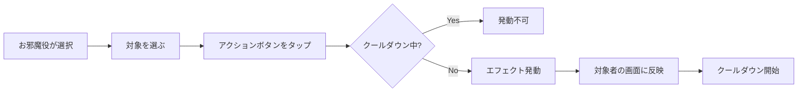

# 06. お邪魔機能

## 6.1 概要

「お邪魔」は、**専用役割**として選択できる妨害特化のポジションです。  
他のプレイヤー（シンガー・バンド）を邪魔して、ゲームにカオスと笑いをもたらします。

---

## 6.2 基本ルール

| 項目 | 内容 |
|------|------|
| **役割タイプ** | 専用役割（役割選択で選ぶ） |
| **対象** | シンガー・バンド全員 |
| **発動制限** | クールダウン制（各アクション個別） |
| **防御手段** | なし（カオス重視） |

---

## 6.3 お邪魔アクション一覧

### シンガー向け

| アクション | 対象 | 効果 | 持続時間 | クールダウン |
|-----------|------|------|---------|-------------|
| **歌詞隠し** | シンガー | 歌詞の一部をモザイク/黒塗り | 5秒 | 15秒 |
| **別の音** | シンガー | 一瞬別の効果音を再生 | 瞬間 | 20秒 |

### バンド向け

| アクション | 対象 | 効果 | 持続時間 | クールダウン |
|-----------|------|------|---------|-------------|
| **ノーツ追加** | バンド | 突然ノーツが増える | 3秒 | 15秒 |
| **ノーツ隠し** | バンド | ノーツが一時的に透明に | 3秒 | 15秒 |

### 全員向け

| アクション | 対象 | 効果 | 持続時間 | クールダウン |
|-----------|------|------|---------|-------------|
| **紙吹雪** | 全員 | 画面に紙吹雪エフェクト乱舞 | 5秒 | 10秒 |

---

## 6.4 画面構成

```
┌─────────────────────────────────┐
│  【お邪魔画面】                  │
├─────────────────────────────────┤
│  対象選択:                       │
│  [ ] シンガー  [ ] バンド全員    │
├─────────────────────────────────┤
│  アクション:                     │
│                                  │
│  [歌詞隠し]  (15秒)              │
│  [別の音]    (20秒)              │
│  [ノーツ追加] (15秒) ← READY     │
│  [ノーツ隠し] (12秒)             │
│  [紙吹雪]    (READY) ← 発動可能  │
│                                  │
└─────────────────────────────────┘
```

**表示要素**:
- **対象選択**: シンガー・バンド個別・全員
- **アクションボタン**: 各お邪魔の種類
- **クールダウン表示**: 残り秒数またはREADY

---

## 6.5 発動フロー



---

## 6.6 各アクション詳細

### 歌詞隠し
**効果**:
- シンガー画面の歌詞の一部（ランダム）を黒塗り
- 5秒間持続

**実装**:
```typescript
// 歌詞の一部をマスク
<span className="blur-md">隠された歌詞</span>
```

---

### 別の音
**効果**:
- 予期しない効果音を一瞬再生
- 例: 犬の鳴き声、拍手、爆発音

**実装**:
```typescript
const sound = new Audio('/sfx/dog-bark.mp3');
sound.play();
```

---

### ノーツ追加
**効果**:
- バンド画面に突然ノーツが追加される
- 3秒間、通常の1.5倍のノーツ密度

**実装**:
- 既存の譜面にランダムでノーツを挿入

---

### ノーツ隠し
**効果**:
- ノーツが透明になる（`opacity: 0.2`）
- 3秒間持続

**実装**:
```typescript
noteElement.style.opacity = '0.2';
```

---

### 紙吹雪
**効果**:
- 画面全体に紙吹雪エフェクト
- 全プレイヤーに影響

**実装**:
```typescript
import confetti from 'canvas-confetti';
confetti({
  particleCount: 100,
  spread: 70,
  origin: { y: 0.6 }
});
```

---

## 6.7 クールダウンシステム

### 管理方式
- **各アクション個別**にクールダウンを管理
- 複数のアクションを組み合わせて使える

### 表示
| 状態 | 表示 |
|------|------|
| **発動可能** | 「READY」（緑色） |
| **クールダウン中** | 残り秒数（赤色） |

### データ構造
```typescript
interface OjamaAction {
  type: 'lyrics_hide' | 'sound' | 'notes_add' | 'notes_hide' | 'confetti';
  target: 'singer' | 'band' | 'all';
  cooldown: number;     // クールダウン時間（秒）
  lastUsed?: number;    // 最後に使用した時刻（ms）
}
```

---

## 6.8 スコアリング

### 基本仕様
- お邪魔成功でアクション1回につき**固定ポイント**
- リザルト画面に表示

### 将来の拡張
- お邪魔を受けた側のミス数に応じてボーナス
- 詳細は[将来の拡張機能](./10_FUTURE_FEATURES.md)参照

---

## 6.9 防御機能

### 基本仕様
- **防御手段なし**
- お邪魔は完全に通る
- パーティゲームとしてのカオス感を重視

### 将来の検討
- お邪魔予告（2〜3秒前に警告）
- シールド機能
- 詳細は[将来の拡張機能](./10_FUTURE_FEATURES.md)参照

---

## 6.10 Supabase同期

### Realtime Broadcast
```typescript
// お邪魔発動をブロードキャスト
supabase.channel('room:123')
  .send({
    type: 'broadcast',
    event: 'ojama',
    payload: {
      action: 'lyrics_hide',
      target: 'singer',
      duration: 5000
    }
  });
```

---

## 次へ

👉 [スコア・ランキング](./07_SCORE_RANKING.md)でスコアシステムの詳細を確認
