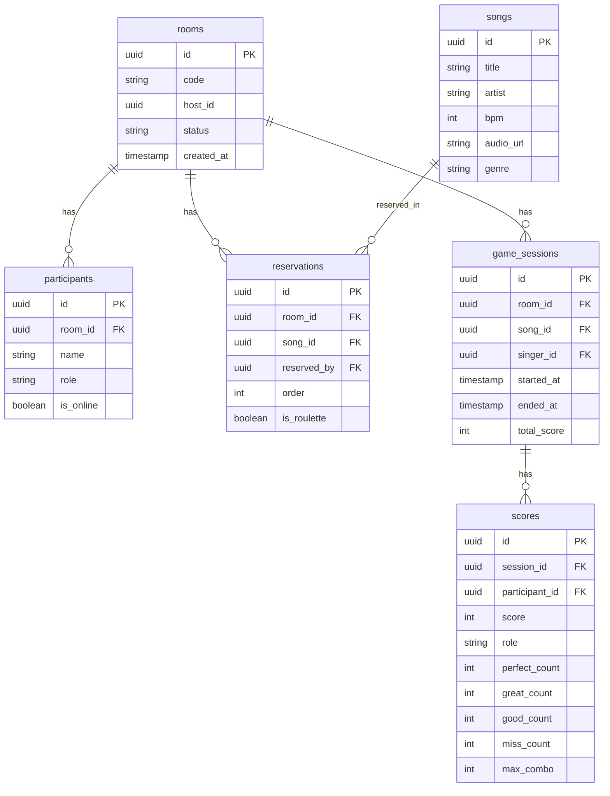

# 09. 技術スタック

## 9.1 技術スタック一覧

| カテゴリ | 技術 | バージョン | 備考 |
|---------|------|-----------|------|
| **フレームワーク** | Next.js | 16 | App Router |
| **言語** | TypeScript | 5 | 型安全性 |
| **UI** | React | 19 | 最新版 |
| **スタイリング** | Tailwind CSS | 4 | ユーティリティCSS |
| **アニメーション** | Framer Motion | latest | マイクロアニメーション |
| **状態管理** | Zustand | latest | 軽量ストア |
| **リアルタイム通信** | Supabase Realtime | latest | WebSocket |
| **バックエンド** | Supabase | latest | BaaS |
| **音声再生** | Web Audio API | - | ブラウザ標準 |
| **エフェクト** | canvas-confetti | latest | 紙吹雪 |
| **ID生成** | uuid | latest | ユニークID |

---

## 9.2 Supabase構成

### 使用サービス

| サービス | 用途 |
|---------|------|
| **Postgres** | データベース（ルーム、スコア等） |
| **Realtime** | リアルタイム同期（Broadcast） |
| **Storage** | 音源ファイル保存 |
| **Auth** | 将来的な認証機能（オプション） |

---

### データベーススキーマ



---

## 9.3 主要な型定義

### 役割タイプ
```typescript
type Role = 'singer' | 'band' | 'ojama';
```

### 楽器タイプ
```typescript
type Instrument = 'guitar' | 'drums' | 'keyboard';
```

### 判定タイプ
```typescript
type Judgment = 'perfect' | 'great' | 'good' | 'miss';
```

### ノーツ
```typescript
interface Note {
  time: number;        // タイミング（ms）
  lane: number;        // レーン番号（0-5）
  type: 'normal' | 'special';  // ノーツタイプ
}
```

### 曲データ
```typescript
interface Song {
  id: string;
  title: string;
  artist: string;
  bpm: number;
  genre: string;
  audio_url: string;
  duration: number;    // 秒
}
```

### 譜面データ
```typescript
interface Chart {
  song_id: string;
  bpm: number;
  notes: Note[];
}
```

### ルームデータ
```typescript
interface Room {
  id: string;
  code: string;        // 6桁
  host_id: string;
  status: 'lobby' | 'playing' | 'result';
  created_at: Date;
}
```

### 参加者データ
```typescript
interface Participant {
  id: string;
  room_id: string;
  name: string;
  role: Role | null;
  is_online: boolean;
}
```

### スコアデータ
```typescript
interface Score {
  id: string;
  session_id: string;
  participant_id: string;
  role: Role;
  score: number;
  perfect_count?: number;
  great_count?: number;
  good_count?: number;
  miss_count?: number;
  max_combo?: number;
}
```

---

## 9.4 ディレクトリ構成

```
src/
├── app/
│   ├── page.tsx                    # 初期画面
│   ├── layout.tsx                  # レイアウト
│   ├── globals.css                 # グローバルスタイル
│   ├── room/
│   │   ├── create/page.tsx         # ルーム作成
│   │   ├── join/page.tsx           # ルーム参加
│   │   └── [roomId]/
│   │       ├── page.tsx            # デンモク画面
│   │       ├── role-select/page.tsx # 役割選択
│   │       ├── singer/page.tsx     # シンガー画面
│   │       ├── band/page.tsx       # バンド画面
│   │       ├── ojama/page.tsx      # お邪魔画面
│   │       └── result/page.tsx     # リザルト画面
│   └── api/
│       └── ... (APIルート、必要に応じて)
│
├── components/
│   ├── ui/
│   │   ├── Button.tsx
│   │   ├── Card.tsx
│   │   ├── Input.tsx
│   │   └── ...
│   ├── game/
│   │   ├── BandGame.tsx            # リズムゲーム本体
│   │   ├── InstrumentSelect.tsx    # 楽器選択
│   │   ├── Note.tsx                # ノート描画
│   │   ├── LyricsDisplay.tsx       # 歌詞表示
│   │   └── OjamaPanel.tsx          # お邪魔パネル
│   ├── denmoku/
│   │   ├── SongList.tsx            # 曲リスト
│   │   ├── ReservationList.tsx     # 予約リスト
│   │   └── ParticipantList.tsx     # 参加者一覧
│   └── result/
│       └── ScoreBoard.tsx          # スコアボード
│
├── lib/
│   ├── supabase.ts                 # Supabaseクライアント
│   ├── audio.ts                    # Web Audio API
│   └── utils.ts                    # ユーティリティ
│
├── store/
│   ├── useGameStore.ts             # ゲーム全体の状態
│   ├── useRoomStore.ts             # ルーム同期
│   └── useRhythmGameStore.ts       # リズムゲーム状態
│
├── data/
│   ├── songs.ts                    # 曲データ
│   └── charts.ts                   # 譜面データ
│
└── types/
    └── index.ts                    # 型定義
```

---

## 9.5 ステート管理（Zustand）

### ゲームストア
```typescript
interface GameState {
  roomId: string | null;
  participants: Participant[];
  currentSong: Song | null;
  isPlaying: boolean;
  setRoomId: (id: string) => void;
  addParticipant: (participant: Participant) => void;
  startSong: (song: Song) => void;
}

export const useGameStore = create<GameState>((set) => ({
  roomId: null,
  participants: [],
  currentSong: null,
  isPlaying: false,
  setRoomId: (id) => set({ roomId: id }),
  addParticipant: (participant) => 
    set((state) => ({ 
      participants: [...state.participants, participant] 
    })),
  startSong: (song) => set({ currentSong: song, isPlaying: true }),
}));
```

---

## 9.6 Supabase Realtime

### Broadcast Channel
```typescript
const channel = supabase.channel(`room:${roomId}`);

// イベント送信
channel.send({
  type: 'broadcast',
  event: 'score_update',
  payload: { participant_id, score }
});

// イベント受信
channel.on('broadcast', { event: 'score_update' }, (payload) => {
  updateScore(payload.participant_id, payload.score);
});

// チャンネル購読
channel.subscribe();
```

---

## 9.7 Web Audio API

### 音声再生
```typescript
const audioContext = new AudioContext();
const audio = new Audio('/songs/song-001.mp3');

// 再生
audio.play();

// 一時停止
audio.pause();

// シーク
audio.currentTime = 30; // 30秒目にジャンプ
```

---

## 9.8 デプロイ

### 推奨プラットフォーム
- **Vercel** (Next.jsの公式ホスティング)
- 自動CD/CI
- プレビュー環境

### 環境変数
```env
NEXT_PUBLIC_SUPABASE_URL=https://xxx.supabase.co
NEXT_PUBLIC_SUPABASE_ANON_KEY=xxx
```

---

## 9.9 将来の拡張技術

以下は将来実装を検討する技術です（オプション）。

| 技術 | 用途 |
|------|------|
| **Three.js** | 3D描画 |
| **React Three Fiber** | Three.jsのReactラッパー |
| **MediaPipe** | カメラポーズ検出 |
| **TensorFlow.js** | 機械学習（ダンサー） |
| **DeviceOrientation API** | ジャイロセンサー |

詳細は[Three.js連動機能](./11_THREE_JS_INTEGRATION.md)参照。

---

## 次へ

👉 [将来の拡張機能](./10_FUTURE_FEATURES.md)でオプション機能を確認
