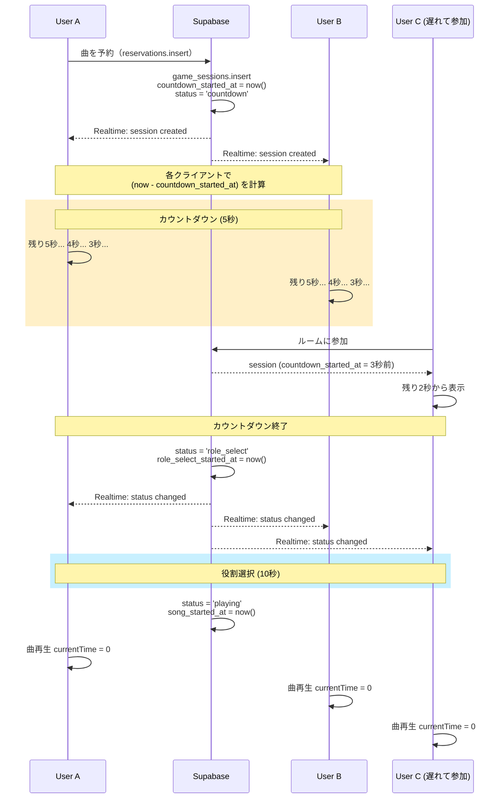

# 12. 時間同期システム仕様

## 12.1 概要

MinKaraでは、複数ユーザーが同時にカラオケ体験を共有するため、全員が**同じ時間軸**で体験する必要があります。
本仕様書は、カウントダウン・曲再生・ゲーム進行における時間同期の技術的実装方法を定義します。

---

## 12.2 課題と解決策

### 課題

| 問題 | 説明 |
|------|------|
| **ローカルタイマーの問題** | 各クライアントが自分の`setInterval`でカウントダウンすると、全員の時間がずれる |
| **遅延参加** | 途中から参加したユーザーも、他のユーザーと同じ体験位置から開始すべき |
| **クロックドリフト** | 各デバイスの内部時計は微妙にずれている可能性がある |

### 解決策: サーバータイムスタンプ方式

**サーバー（Supabase）に開始時刻を保存し、各クライアントが「現在時刻 - 開始時刻」で経過時間を計算する**

```
┌─────────────────────────────────────────────────────────────┐
│                    Supabase Database                         │
│  ┌─────────────────────────────────────────────────────┐    │
│  │ game_sessions テーブル                               │    │
│  │   countdown_started_at: 2026-01-18T18:30:00.000Z    │    │
│  │   song_started_at:      2026-01-18T18:30:10.000Z    │    │
│  └─────────────────────────────────────────────────────┘    │
└─────────────────────────────────────────────────────────────┘
                              │
                              │ 全クライアントが同じ開始時刻を参照
                              ▼
┌──────────────┐  ┌──────────────┐  ┌──────────────┐
│   User A     │  │   User B     │  │   User C     │
│ now - start  │  │ now - start  │  │ now - start  │
│ = 経過時間   │  │ = 経過時間   │  │ = 経過時間   │
└──────────────┘  └──────────────┘  └──────────────┘
```

---

## 12.3 データベース設計

### game_sessions テーブル

ゲームセッション（1曲の演奏）を管理するテーブル。

```sql
CREATE TABLE game_sessions (
  id UUID PRIMARY KEY DEFAULT gen_random_uuid(),
  room_id TEXT REFERENCES rooms(id) ON DELETE CASCADE,
  reservation_id UUID REFERENCES reservations(id),
  song_id TEXT NOT NULL,
  singer_id TEXT NOT NULL,
  
  -- 時間同期の核心
  countdown_started_at TIMESTAMPTZ,  -- カウントダウン開始時刻（サーバー時刻）
  song_started_at TIMESTAMPTZ,       -- 曲再生開始時刻（サーバー時刻）
  ended_at TIMESTAMPTZ,              -- 終了時刻
  
  -- ステータス管理
  status TEXT DEFAULT 'waiting',     -- waiting | countdown | role_select | playing | finished
  
  created_at TIMESTAMPTZ DEFAULT now()
);

-- RLSポリシー（全員が読み書き可能）
ALTER TABLE game_sessions ENABLE ROW LEVEL SECURITY;
CREATE POLICY "Anyone can read" ON game_sessions FOR SELECT USING (true);
CREATE POLICY "Anyone can insert" ON game_sessions FOR INSERT WITH CHECK (true);
CREATE POLICY "Anyone can update" ON game_sessions FOR UPDATE USING (true);
```

### ステータス遷移

```
waiting → countdown → role_select → playing → finished
   │                      │
   │                      │ 10秒間
   │                      ▼
   └──────────────────────┘
```

| ステータス | 説明 | 継続時間 |
|-----------|------|---------|
| `waiting` | セッション作成直後 | - |
| `countdown` | 「まもなく開始」表示中 | 5秒 |
| `role_select` | 役割選択画面表示中 | 10秒 |
| `playing` | 曲再生中 | 曲の長さ |
| `finished` | リザルト表示可能 | - |

---

## 12.4 クライアント実装

### カウントダウン計算

**重要**: `setInterval`で1秒ずつ減らすのではなく、毎回サーバー時刻との差分を計算する

```typescript
// ❌ NG: ローカルタイマー方式（全員の時間がずれる）
const [countdown, setCountdown] = useState(10);
useEffect(() => {
  const timer = setInterval(() => {
    setCountdown(prev => prev - 1);
  }, 1000);
  return () => clearInterval(timer);
}, []);

// ✅ OK: サーバー時刻差分方式（全員同じ時間）
function useServerSyncedCountdown(
  startedAt: string | null, 
  duration: number
): number {
  const [remaining, setRemaining] = useState(duration);
  
  useEffect(() => {
    if (!startedAt) return;
    
    const startTime = new Date(startedAt).getTime();
    
    const update = () => {
      const now = Date.now();
      const elapsed = (now - startTime) / 1000;
      const remaining = Math.max(0, duration - elapsed);
      setRemaining(remaining);
    };
    
    update(); // 初回即座に計算
    const interval = setInterval(update, 100); // 100msごとに更新（滑らか）
    
    return () => clearInterval(interval);
  }, [startedAt, duration]);
  
  return remaining;
}
```

### 曲再生位置の同期

```typescript
function useSyncedAudioPlayback(
  songStartedAt: string | null,
  audioRef: React.RefObject<HTMLAudioElement>
) {
  useEffect(() => {
    if (!songStartedAt || !audioRef.current) return;
    
    const startTime = new Date(songStartedAt).getTime();
    const now = Date.now();
    const elapsedSeconds = (now - startTime) / 1000;
    
    const audio = audioRef.current;
    
    // 曲の長さを超えていなければ、その位置にシークして再生
    if (elapsedSeconds < audio.duration) {
      audio.currentTime = elapsedSeconds;
      audio.play().catch(console.error);
    }
  }, [songStartedAt, audioRef]);
}
```

### Realtime購読

```typescript
function useGameSession(roomId: string) {
  const [session, setSession] = useState<GameSession | null>(null);
  
  useEffect(() => {
    // 初回取得
    supabase
      .from('game_sessions')
      .select('*')
      .eq('room_id', roomId)
      .eq('status', 'playing') // または適切なステータス
      .order('created_at', { ascending: false })
      .limit(1)
      .single()
      .then(({ data }) => setSession(data));
    
    // Realtime購読
    const channel = supabase
      .channel(`game:${roomId}`)
      .on('postgres_changes', {
        event: '*',
        schema: 'public',
        table: 'game_sessions',
        filter: `room_id=eq.${roomId}`,
      }, (payload) => {
        setSession(payload.new as GameSession);
      })
      .subscribe();
    
    return () => {
      supabase.removeChannel(channel);
    };
  }, [roomId]);
  
  return session;
}
```

---

## 12.5 セッション開始フロー

### フロー図



### タイミング詳細

| フェーズ | トリガー | 継続時間 | 処理 |
|---------|---------|---------|------|
| 予約追加 | ユーザーが曲を予約 | 即座 | `game_sessions` 作成 |
| カウントダウン | セッション作成時 | 5秒 | 「まもなく開始」表示 |
| 役割選択 | カウントダウン終了 | 10秒 | バンド/お邪魔選択 |
| 曲再生 | 役割選択終了 | 曲の長さ | ゲームプレイ |
| リザルト | 曲終了 | - | スコア表示 |

---

## 12.6 遅延参加の処理

| シナリオ | 処理 |
|---------|------|
| **カウントダウン中に参加** | 残り時間を計算して表示（例: 3秒残り） |
| **役割選択中に参加** | 残り時間を計算、選択可能なら選択画面を表示 |
| **曲再生中に参加** | `audioRef.currentTime = elapsed` で途中から再生 |
| **曲終了後に参加** | リザルト画面を表示 |

---

## 12.7 クロック補正（オプション）

クライアントのシステム時計がサーバーと大きくずれている場合の補正処理。

```typescript
// Supabase Function (Edge Function) でサーバー時刻を返す
// または PostgreSQL関数を使用
async function getServerTimeOffset(): Promise<number> {
  const before = Date.now();
  
  const { data } = await supabase.rpc('get_server_time');
  // get_server_time: SELECT now() AS server_time
  
  const after = Date.now();
  const roundTrip = after - before;
  const serverTime = new Date(data.server_time).getTime();
  
  // ネットワーク遅延の半分を補正
  const estimatedServerTime = serverTime + roundTrip / 2;
  const offset = estimatedServerTime - after;
  
  return offset; // ミリ秒単位のオフセット
}

// 使用時
const offset = await getServerTimeOffset();
const adjustedNow = Date.now() + offset;
const elapsed = (adjustedNow - startTime) / 1000;
```

> **Note**: 通常のネットワーク環境では、オフセットは数十〜数百ミリ秒程度。
> 音楽ゲームとしては許容範囲だが、シビアな場合は補正を実装する。

---

## 12.8 実装ファイル構成

```
src/
├── hooks/
│   ├── useGameSession.ts      # セッション管理・Realtime購読
│   ├── useSyncedCountdown.ts  # サーバー同期カウントダウン
│   └── useSyncedAudio.ts      # 曲再生同期
├── lib/
│   └── supabase.ts            # Supabaseクライアント
└── app/room/[roomId]/
    ├── page.tsx               # デンモク（セッション開始トリガー）
    ├── role-select/page.tsx   # 役割選択（10秒同期）
    ├── singer/page.tsx        # シンガー画面
    ├── band/page.tsx          # バンド画面（曲同期再生）
    └── ojama/page.tsx         # お邪魔画面
```

---

## 12.9 トラブルシューティング

| 問題 | 原因 | 解決策 |
|------|------|--------|
| ユーザー間で時間がずれる | ローカルタイマーを使っている | サーバータイムスタンプ方式に修正 |
| 遅れて参加すると曲の頭から始まる | `currentTime`をセットしていない | `elapsed`を計算してシーク |
| カウントダウンがカクつく | 更新間隔が長い | `setInterval`を100msに設定 |
| 時計が大きくずれているデバイス | クロックドリフト | サーバー時刻オフセット補正を実装 |

---

## 12.10 将来の拡張

- **NTP同期**: より精密な時刻同期が必要な場合
- **WebRTC活用**: P2Pでの低遅延同期
- **サーバーサイドタイマー**: Edge Functionでタイマーを管理

---

## 次へ

👉 実装後は各ゲーム画面（シンガー/バンド/お邪魔）に同期処理を組み込む
